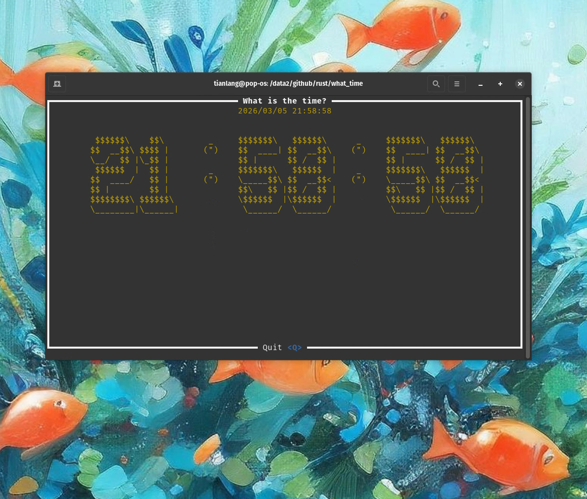

# What time


[Development Video Log](bilibili.com/video/BV14zAazoE4N/)
## How to run
```bash 
git clone git@github.com:TianLangStudio/what_time.git
cargo run
```

## License

Copyright (c) [FusionZhu](https://www.upwork.com/freelancers/~017ecd3894e805207c?mp_source=share) 

This project is licensed under the MIT license ([LICENSE] or <http://opensource.org/licenses/MIT>)

[LICENSE]: ./LICENSE
